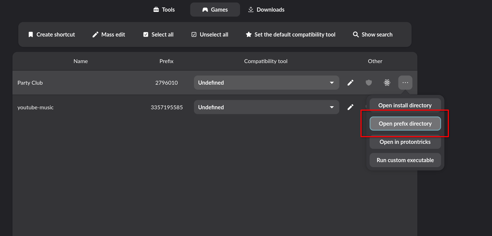

# 游戏和模组管理

## 兼容性工具和 Windows 游戏管理


Windows 游戏在 Bazzite 上运行时都需要借助**兼容性工具**。Steam 提供的 Proton 是其中之一，但通过 ProtonPlus 等工具也可以配置[GE-Proton](https://github.com/GloriousEggroll/proton-ge-custom) 和 [Luxtorpeda](https://codeberg.org/luxtorpeda/luxtorpeda)一类的其他工具。

## Protontricks


有些游戏可能需要在 Prefix 中安装特定的 Windows DLL 组件，此时可以使用预安装的 [Protontricks](https://github.com/Matoking/protontricks) 或 Lutris 自带的 [Winetricks](https://github.com/Winetricks/winetricks) 等工具进行操作。

## 文件管理器中的隐藏文件

!!! note

    Windows 程序通过 Wine 运行时，文件管理视图的隐藏文件显示开关由 Prefix 下的 winecfg 控制。

有些游戏相关的重要文件可能保存在默认隐藏的目录下。

在文件管理器中选择 **Hamburger menu**（_三条横杠_），并勾选“显示隐藏文件”。

和 Windows 将隐藏作为独立属性处理不同，在 Linux 下有且只有名字开头为`.`的文件和文件夹为隐藏状态。


### Prefix 是什么？

Prefix 是 Proton 和 Wine 在运行 Windows 程序时创建的模拟 Windows 环境的骨架。游戏在其安装目录之外创建文件时，纯 Windows 的路径会自动转换成 Prefix 下的路径。

!!! important

    **Steam 上的游戏**一般都安装在`~/.steam/root/steamapps/common/<游戏名>`文件夹下。

许多 Windows 游戏往往会将设置和存档等内容保存在 Windows 的`My Documents`或`AppData`等用户文件夹下，因此如果要进行游戏模组的配置或用户数据的备份，则 Prefix 的内容会很重要。


对于 Steam 上的游戏，Prefix 的默认路径是`~/.steam/root/steamapps/compatdata/`下**游戏的 AppID 的文件夹**：

!!! tip
    
    在 ProtonPlus 的 **Games** 中选择特定游戏并 **Open prefix directory** 即可在文件管理器中快速打开 Prefix。
    

- 在游戏 Steam 属性的 **更新** → **App ID** 一栏也能看到游戏的 ID。
- 该文件夹下的`pfx/drive_c/`目录即为游戏所看到的 “C 盘”。

非 Steam 游戏的 Prefix 位置则完全不受限制，比如 Lutris 一般会选择保存在`~/Games`目录下。

#### Proton Prefix 出问题了？

!!! warning

    删除 Proton Prefix **_可能_** 会导致存档或配置数据丢失！

=== "通过 Protontricks"
    
    1. Select your game in Protontricks
    2. Click **Select the default wineprefix**
    3. Click **Delete ALL DATA AND APPLICATIONS INSIDE THIS PROTON PREFIX**
    
=== "手动删除"
    
    打开 Prefix 文件夹，手动删除内容。
    
    请注意不要删除上层的文件夹，比如`compatdata`或`~/Games`或启动器默认配置的位置，否则会影响到其他游戏。

## 模组管理

-   最方便的模组配置方法是 **Steam 创意工坊**，但它很可能不支持你需要的游戏或模组，并且必须在 Steam 上购买该游戏才能使用。
-   有些模组管理器，比如 [r2modman](https://github.com/ebkr/r2modmanPlus)，提供了专门的 Linux 版本。
-   如果只是单纯的替换游戏文件，通常可以在游戏目录和 Proton Prefix 目录下直接操作，但偶尔会有特殊情况。
    -   有些模组，尤其是 DLL 替换相关，可能需要 [在 WINE 设置中更改 DLL 顶替](#wine-dll-override)
-   有些只支持 Windows 的模组管理器或启动器可以作为非 Steam 游戏加入 Steam 资源库，然后通过符号链接绑定到目标游戏的实际 Prefix 上。
    


### WINE 配置 DLL 顶替

以下方法都可以配置 WINE Prefix 下 DLL 顶替。

=== "Protontricks（需要通过 Steam/Proton 运行的游戏）"

    1. 在 Protontricks 中选择游戏
    2. 选择**选择默认的 Wine 容器**
    3. 选择**运行 Wine 配置程序**
    4. 在**函数库**部分，添加你需要的 DLL 名称
    
=== "直接运行 Wine 配置程序（非 Steam 启动）"

    1. 在 Lutris、Faugus Launcher 等启动器下，选择游戏后找到类似于 **Wine Configuration** 的选项
    2. 在**函数库**部分，添加你需要的 DLL 名称

=== "环境变量"
    
    在 Steam 或其他启动器的选项中定义环境变量`WINEDLLOVERRIDES`，比如以下示例对应 **DirectInput 8 的 DLL 顶替**：
    ```bash
    WINEDLLOVERRIDES="dinput8=n,b" %command%
    ```
